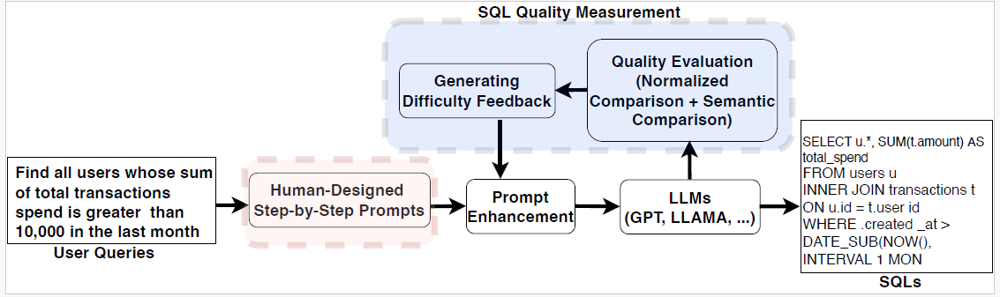

# Enhancing LLM Fine-tuning for Text-to-SQLs by SQL Quality Measurement
> **Two complementary pipelines** for converting natural-language questions to SQL, grading the output (string **and** semantic similarity), and self-refining the query until a quality threshold is reached.

| Script                    | Model family                           | Typical scenario                                       |
|---------------------------|----------------------------------------|--------------------------------------------------------|
| `llama_quality_check.py`  | **Open-weights LLaMA-2 / HF causal-LM**| On-prem GPU fine-tuning with LoRA + 8-bit quantization |
| `updated_gpt_request.py`  | **OpenAI GPT-3.5 / GPT-4 / GPT-4o**    | Rapid prototyping via OpenAI API (no GPU required)     |

---

## Pipeline Overview



## Step-by-Step Prompting & SQL Quality Feedback

The proposed method enhances Text-to-SQL generation using:

- **Human-designed step-by-step prompts**
- **SQL quality feedback loops**

---

###  A. Step-by-Step Prompts

LLMs follow 8 guided steps to build accurate SQL:

1. **Understand schema**: Identify relevant tables and columns.
2. **Plan joins**: Determine relationships and required joins.
3. **Select columns**: Choose the information to retrieve.
4. **Apply filters**: Add conditions using `WHERE` clauses.
5. **Check for aggregation**: Use `GROUP BY`, `HAVING` if needed.
6. **Sort results**: Apply `ORDER BY` or `LIMIT`.
7. **Optimize structure**: Consider subqueries or `WITH` clauses.
8. **Compose SQL**: Integrate all steps into the final query.

---

### B. SQL Quality Measurement

SQL quality is evaluated with two key methods:

#### 1. Normalized Comparison

- Compares generated SQL with ground truth using Levenshtein distance.
- Measures syntactic similarity after normalization.

#### 2. Semantic Comparison

- Checks if the **type** of result from the generated SQL matches that from ChatGPT's direct answer.

#### 3. Difficulty Feedback

Based on syntax similarity (`fnc`) and number of columns (`Ncol`):

- `0`: Simple
- `1`: Moderate
- `2`: Difficult

#### 4. Feedback Trigger

Prompt refinement is triggered if:
- SQL fails semantically (`fsc = 0`)
- Or normalized score is low and query is moderate/difficult

---

### D. Extended Prompt (on Feedback)

If triggered, 5 additional refinement steps are inserted between steps 5–6:

1. **Complex joins & subqueries**
2. **Data transformations & calculations**
3. **Performance optimization**
4. **Security and data integrity**
5. **Review and test the query**

These help LLMs handle harder SQLs and avoid execution errors.

---

##  Core Features

- Difficulty-aware prompts (simple / moderate / complex)  
- Dual grading – **string similarity** *and* **semantic (result-set) equivalence**  
- Up to **three** self-refinement attempts with structured feedback  
- Optional **ablation study** (`full`, `no-feedback`, `no-semantic`) → `ablation.png`  
- Clean JSON outputs, feedback logs, and optional Chain-of-Thought (CoT) tracking  

---

## 1. Installation

```bash
# Common dependencies (Python 3.9+ recommended)
pip install pandas tqdm sqlparse rapidfuzz matplotlib

# For LLaMA-based fine-tuning
pip install torch transformers peft bitsandbytes

# For OpenAI API
pip install openai backoff
```

---

## 2. Dataset & Folder Structure

```
text2sql-quality-refiner/
├── data/
│   ├── train.json
│   ├── dev.json
│   └── databases/
│       └── <db_id>/<db_id>.sqlite
├── src/
│   ├── llama_quality_check.py
│   └── updated_gpt_request.py

```

### Example JSON Record

```json
{
  "db_id": "concert_singer",
  "question": "How many singers are from USA?",
  "SQL": "SELECT COUNT(*) FROM singer WHERE nation = 'US'",
  "evidence": "nation column stores the country",
  "difficulty": "simple"
}
```

> SQLite file must be located at:  
> `data/databases/<db_id>/<db_id>.sqlite`

---

## 3. `llama_quality_check.py` — Open-weights pipeline

### 3.1 Run (LoRA fine-tuning or inference)

```bash
python llama_quality_check.py \
  --do_train \
  --train_path   data/train.json \
  --eval_path    data/dev.json \
  --db_root_path data/databases \
  --engine       meta-llama/Llama-2-7b-hf \
  --output_dir   checkpoints/llama_ft \
  --batch_size   2 \
  --run_ablation
```

### 3.2 Key Arguments

| Flag               | Default     | Description                                                   |
|--------------------|-------------|---------------------------------------------------------------|
| `--do_train / --do_eval` | None        | Enables training or evaluation mode                           |
| `--engine`         | LLaMA-2-7b  | Any Hugging Face causal LM                                    |
| `--lora_rank`      | 16          | LoRA adapter rank                                              |
| `--norm_threshold` | 0.75        | Similarity threshold to trigger semantic execution             |
| `--run_ablation`   | off         | Enables ablation breakdown plot                                |
| `--max_length`     | 2048        | Max token length                                               |
| `--exec_timeout`   | 20          | SQLite timeout (in seconds)                                    |

### 3.3 Outputs

- `preds.json` – SQL predictions per question  
- `ablation.png` – Performance bar chart  
- `loft_logs/` – Attempt-wise logs  
- `checkpoints/llama_ft/` – LoRA-tuned model artifacts  

---

## 4. `updated_gpt_request.py` — OpenAI API pipeline

### 4.1 Run (GPT-3.5 / GPT-4 / GPT-4o)

```bash
export OPENAI_API_KEY="sk-..."

python updated_gpt_request.py \
  --eval_path     data/dev.json \
  --db_root_path  data/databases \
  --engine        gpt-4o-mini \
  --data_output_path preds/predict_dev.json \
  --use_knowledge True \
  --chain_of_thought True
```

### 4.2 Key Arguments

| Flag                   | Description                                                      |
|------------------------|------------------------------------------------------------------|
| `--mode`               | Choose `dev` or `test` split                                     |
| `--engine`             | OpenAI model name (e.g. `gpt-4`, `gpt-4o-mini`)                  |
| `--use_knowledge`      | Adds `evidence` field to prompt                                  |
| `--chain_of_thought`   | Appends "Let's think step-by-step." and retains CoT in output    |
| `--max_attempts`       | Max retries per question (default: 3)                            |
| `--backoff_seconds`    | Initial retry delay for rate-limit handling                      |
| `--resultset_tolerance`| Looseness for semantic equivalence (e.g., float or order match)  |

### 4.3 Outputs

- `predict_<split>(_cot).json` — Best SQL per question (CoT optional)  
- `feedback_results.txt` — Attempt logs  
- `rate_limit.log` — OpenAI retry trace

---

## 5. Choosing the Right Script

| Use Case                                 | Script                   | Why                                                         |
|------------------------------------------|--------------------------|--------------------------------------------------------------|
| On-prem training with full control       | `llama_quality_check.py` | Runs locally with PEFT, no API needed                       |
| Fast results with strong zero-shot model | `updated_gpt_request.py` | Plug-and-play via OpenAI, best performance with GPT-4o      |

---

## 6. Troubleshooting

- **torch.bmm device error** → Handled internally (LLaMA only)  
- **OpenAI 429 or 5xx** → Retries automatically with exponential backoff  
- **OOM or long prompt** → Try reducing `--max_length`, remove `--use_knowledge`  
- **Missing DB** → Ensure: `data/databases/<db_id>/<db_id>.sqlite`

---

## 7. Contributing

- Fork → branch → pull request  
- Run code format checks:
  ```bash
  pre-commit run --all-files
  ```
- To add new backend: register it in `quality_check.py`

---

